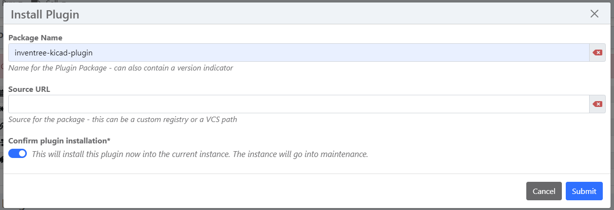

# InvenTree KiCad - HTTP Library Plugin

A KiCad Conform API endpoint plugin, designed for integration with [InvenTree](https://inventree.org), empowers users to seamlessly incorporate InvenTree parts into KiCad's parts library tool. Please note that this plugin exclusively offers metadata and necessitates the presence of corresponding symbol and footprint libraries within the KiCad EDA environment.

As of the current stage of development, KiCad exclusively offers read-only access to parts through the HTTP lib interface. However, this plugin provides a metadata import tool to import chsnges made inside KiCad. This enables users to add footprints, symbols and datasheets to individual parts during the schematic design and reimport that information into InveTree to have it available for the nect time.
## Installing the Plugin
There are several methods available for installing this plugin. To gain a comprehensive understanding of the installation process, please refer to the [InvenTree - Installing a Plugin Guide](https://docs.inventree.org/en/latest/extend/plugins/install/#installation-methods). Depending on your preferred approach, the following instructions will provide you with the necessary information.

Prior to plugin installation, ensure that you've activated both **URL Integration** and **App Integration**. You can accomplish this by going to Settings → Plugin Settings → Plugins. Additionally, if you're operating within a Docker environment, be sure to enable **Check plugins on startup** as well.


### Through GitHub
Navigate to the **Plugin Settings** and click on the Install Plugin button. This will trigger a new window to appear, prompting you to enter the following information:

- Package Name: inventree-kicad-plugin
- Source URL: git+https://github.com/afkiwers/inventree-kicad-plugin


### Through PiP
The plugin can be found here: [inventree-kicad-plugin](https://pypi.org/project/inventree-kicad-plugin/).

- Package Name: inventree-kicad-plugin




**IMPORTANT**: Remember to restart your server and run the migrate command to implement the model changes required for this plugin. Failure to do so may result in the plugin encountering issues and not functioning correctly.

## Configure Plugin Settings
After installing the plugin, head over to the Plugin Settings and activate it. Look for **KiCadLibraryPlugin** in the list of available plugins. Once activated, you'll be able to open the plugin and proceed with the setup process.


## Adding Categories to KiCad
Navigate to the admin backend, and scroll down until you find the **INVENTREE_KICAD** section. Within this section, click on **KiCad Categories**.
If the section is not visible, ensure you've enabled the "Enable URL integration" and "Enable app integration" options in the Plugin Settings and run a database migration.


Once opened the "KiCad Categories" model, you'll have the option to add new categories which, once added, will be visible in KiCad's Symbol Chooser dialog.


#### Default Settings for Categories
The plugin allows you to set default values when the child part lacks specific details regarding the KiCad symbol, footprint, or reference. This feature is particularly useful when dealing with components such as resistors or capacitors, as they often share the same symbols, reducing the need for repetitive data entry.


## Creating User Access Tokens
Head back to the admin backend and click on Tokens. Click on "ADD Token" to generate a token dedicated to a particular user. It is important to emphasize that it is highly advisable to create individual tokens for each user, rather than employing a single token for everyone.


## KiCad Configuration files
Below is an example config which should help you get started reasonably quickly. The only thing needed here is to replace **http://127.0.0.1:8000** with your server's InvenTree URL, and replace usertokendatastring with a valid token. Save it as a file with `.kicad_httplib` extension, as specified in the [preliminary KiCad docs](https://docs.kicad.org/master/en/eeschema/eeschema_advanced.html#http-libraries). To use it, add it as a symbol library inside KiCad.

**Please Note**: The config file does not contain any part or category information. It merely tells KiCad what API to expect, what token to use and where to find it.

```json
{
    "meta": {
        "version": 1.0
    },
    "name": "KiCad HTTP Library",
    "description": "A KiCad library sourced from a REST API",
    "source": {
        "type": "REST_API",
        "api_version": "v1",
        "root_url": "http://127.0.0.1:8000/plugin/kicad-library-plugin",
        "token": "usertokendatastring"
    }
}
```
## Add the HTTP library to KiCad

Inside KiCads project manager, navigate to `Preferences -> Manage Symbol Libraries` and click on it. Add a GLobal Library by pressing the folder in the bottom left corner.


When choosing the `.kicad_httplib` file, KiCad will automatically detect that it is a HTTP lib file and only a Nickname needs to be set.

It's recommended to put a **#** as prefix to make sure it is at the top of the list. Otherwise one might end up scrolling a lot.

## Use in KiCad

Once everything has been configured properly, KiCad should be able to display all the categories and parts using the Symbol Picker. 

Inside the schematic, one can either use the shortcut and press **A** or navigate to the ribbon at the top and press `Place -> Add Symbol`.


The Symbol Chooser should open up and display the parts sourced from InvenTree.


## Importing Metadata from Previous Projects
Since KiCad does not offer a way to push information back to the server, InvenTree needs to have all that metadata such as footprints and symbols added manually. This can be very tedious, especially when there are thousands of parts.

This plugin's import tool uses KiCads intermediate file which is created whenever there is a BOM export. This file contains all the project's data which is needed.

 

## FAQ

### Why does this Plugin need the App Mixin?

This plugin uses the App Mixin to add a custom model to the database to manage the selected categories. Otherwise, KiCad symbol chooser would be cluttered with every single category (See [Categories](#adding-categories-to-kicad))

### Why does this Plugin need the Url Mixin?

This plugin uses the Url Mixin to expose custom API endpoints which are conform with KiCads REST API requirements.

